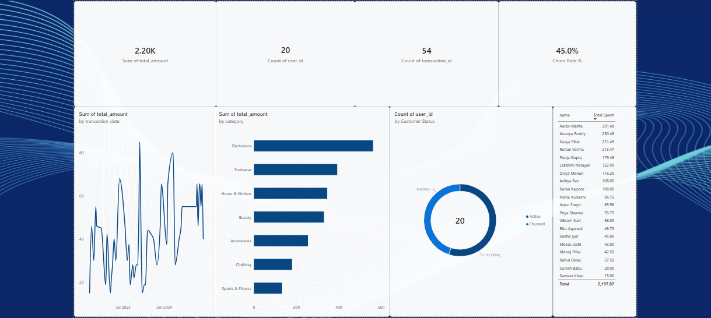

# E-Commerce Customer Churn & Revenue Analysis

## Business Problem
Online retailers lose significant revenue when customers quietly stop purchasing, often without any warning sign the business notices in time. This project analyzes a simulated e-commerce dataset to identify churned vs. active customers, uncover revenue trends, and surface which product categories and customers drive the most value — turning raw transaction data into decisions a business can act on.

## Tech Stack
- **PostgreSQL** — relational database design, data cleaning, and analytical SQL queries (joins, aggregations, window functions)
- **Power BI** — interactive dashboard for KPI tracking and visual storytelling
- **DAX** — custom measures and calculated columns for churn classification and revenue metrics

## Dataset
Synthetic 3-table relational dataset modeling a real e-commerce business:
- `users.csv` — 20 customers with signup date, location, and demographics
- `products.csv` — 10 products across 7 categories
- `transactions.csv` — 54 purchase transactions linking customers to products over a 15-month period

## Key SQL Insights
- Built a full relational schema in PostgreSQL with enforced foreign key constraints between users, products, and transactions
- Wrote aggregation queries to identify top revenue-generating customers and category-level revenue share
- Used a `LAG()` window function partitioned by customer to calculate purchase frequency (days between consecutive orders) — enabling a direct comparison of buying cadence between active and churned customers
- Defined churn dynamically (180+ days since last purchase, anchored to the dataset's own most recent transaction date) rather than a hardcoded "today," so the logic holds up against any snapshot of the data

## Dashboard

The dashboard tracks four core KPIs (Total Revenue, Total Customers, Total Orders, Churn Rate) alongside:
- A monthly revenue trend line chart spanning the full 15-month period
- Revenue breakdown by product category
- An Active vs. Churned customer split (donut chart)
- A ranked table of top customers by total spend

## Data-Driven Recommendations
- **45% of customers have churned** (no purchase in 180+ days) — this is a critical retention gap worth a targeted win-back campaign (e.g., a discount email to the 9 churned customers identified in this dataset)
- **Electronics and Footwear are the top two revenue categories**, together driving over half of total revenue — inventory and marketing budget should be weighted accordingly
- The gap in purchase frequency between active and churned customers (calculated via SQL window functions) suggests that customers who go quiet do so gradually, not suddenly — giving the business a window to intervene with re-engagement campaigns before a customer fully churns

## How to Reproduce
1. Import the three CSVs into a PostgreSQL database using the schema in this repo
2. Run the analytical SQL queries (see `/sql` folder — coming soon) to reproduce the churn and revenue insights
3. Connect Power BI Desktop to the PostgreSQL database and load the tables to rebuild the dashboard